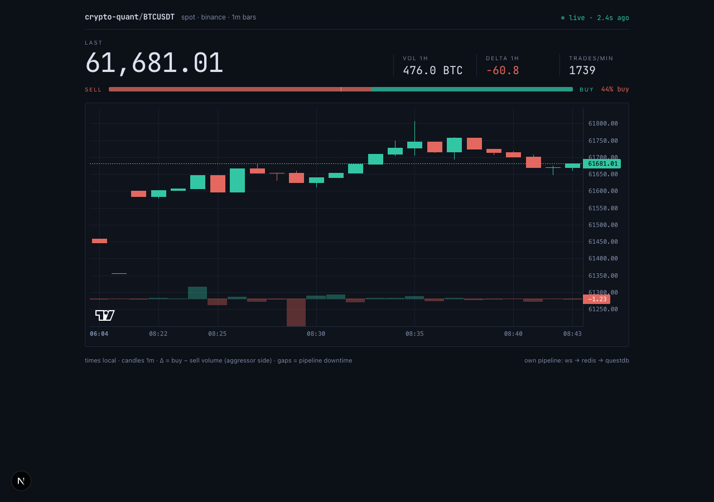

# crypto-quant — modern-stack learning build

[](https://github.com/JermaBolder/crypto-quant/actions/workflows/ci.yml)
[](LICENSE)

Goal: learn the modern data/quant stack by building a real one. Money was
explicitly secondary; the honest research verdict below is part of the point.
The full research story — method, numbers, and why the negative results are
the finding — is written up in [docs/research.md](docs/research.md).



Roadmap: **0 data+DB ✓ · 1 streaming ✓ · 2 ML signals ✓ · 5 prod ✓ · ML v2 ✓ (closed: no edge) · 3 dashboard ✓ · tests+CI ✓ · 6 carry ✓ (harvest yes, timing no) · 7 ops watchdog ✓ · 8 ethena ✓ (structure, not alpha)**

## Architecture
```
Binance WS ──producer──▶ Redis Stream "trades" ──consumer(group)──▶ QuestDB
   (cq_producer)             (cq_redis)            (cq_consumer)    (cq_questdb)
                                                                        │
                                              (cq_watchdog) watchdog ◀──┘──▶ Telegram
```
All five run as Docker containers (`restart: unless-stopped`, healthchecks,
data in the `qdb_data` volume). Producer and consumer are decoupled in time:
either can crash, restart, or lag without taking the other down. The consumer
ACKs an entry only *after* the DB write succeeds (at-least-once delivery).
The watchdog watches the honest health metric — latest trade age, end-to-end —
and pushes a Telegram alert on state changes (stalled / DB down / recovered),
with hysteresis (alert ≥120s, recover <60s) so it never flaps.

Research path (offline, on the host):
```
data.binance.vision ──backfill──▶ agg_trades ──dataset──▶ features+label ──model──▶ verdict
```

Dashboard path (host):
```
QuestDB ──api.py (FastAPI :8000)──▶ dashboard/ (Next.js :3000, polls every 3s)
```
The browser never talks to the DB: /exec accepts arbitrary SQL, so the API is
the boundary — it exposes four narrow read-only questions (/health /bars /stats
/funding). The funding panel visualizes the carry study's data right in the
terminal: recent 8h funding as a teal(+)/coral(−) bar sparkline + carry stats.

## Research verdict (v1 + v2): NO EDGE — and that's the result
- **v1** (14 days, 9 features, logreg): OOS hit 48.3%, net −16.3 bps/bet.
- **v2** (90 days / 80.3M trades, 22 features incl. trade-size structure &
  vol-regime, vol-scaled label dead zone, purged walk-forward, logreg +
  gradient boosting, abstain threshold picked inside train):
  every config negative, 0/5 positive folds everywhere. Best: HGB @ H=60m,
  hit 51.8% but net **−13.1 bps/bet** — the model does find a weak
  statistical signal (~+2 bps gross vs ~15 bps round-trip cost), i.e.
  *predictability without tradability*.
- Stop rule agreed in advance: net ≤ 0 ⇒ iteration closed, no further tuning.
  Weak public-data signals on 1m BTC do not survive costs. Verified, twice.

## Carry study (funding/basis, USDT-M perp): HARVEST YES, TIMING NO
- **Mechanism**: every 8h the perp transfers funding between longs and shorts;
  short perp + long spot collects it delta-neutrally while the premium index
  marks against the short leg. Costs are charged on **turnover** (14 bps per
  leg change, 28 round trip), not per interval — the structural reason carry
  can survive the fees that killed the 1m ML signal.
- **Data**: 2020-01 … 2026-06, 7,089 8h intervals (funding + premium-index
  klines). Funding: mean +1.09 bps/8h, median +0.96 (≈ the 1 bp default rate),
  85.6% positive, autocorr(1) 0.80.
- **Always-on harvest**: net **+1.09 bps/8h ≈ +11.9%/yr** after full retail
  costs — one round trip in 6.5 years, turnover ≈ 0.
- **Timing rules** (θ on funding level / 3-interval mean, θ picked inside train
  folds, purged walk-forward, OOS-only): best nets +0.31 bps/8h vs always-on's
  +0.92 **on the same OOS rows**. The "obvious" hold-when-f>0 filter *loses*
  −0.83 bps/8h held: 481 entries × 28 bps eat far more than the negative
  intervals they avoid. Every filter pays more in fees than it saves.
- Stop rule agreed in advance: rule ≤ always-on OOS ⇒ chapter closed. **The
  carry exists; timing it doesn't.** Caveat: signal-quality proxy, not a
  backtest — margin, liquidation risk on the short leg, drawdowns ignored.

## Ethena study (sUSDe vs our carry): STRUCTURE, NOT ALPHA
- **Question**: sUSDe is the institutional version of the carry trade above and
  publishes what it actually paid stakers. Our measured BTC funding grosses
  6.79%/yr on the same 866-day window; sUSDe realized **10.04%/yr**. Why?
- **Hedge choice is dead**: ETH funding 6.99 vs BTC 6.79 %/yr — +0.20 pp; no
  "hotter hedge" story, so cross-venue spreads are second-order too.
- **Concentration dominates — and over-explains**: yield accrues on all of
  USDe's backing but pays only the staked ~48.8% → a 2.29× multiplier,
  predicting 16.6–17.3 %/yr. Realized sits **6.6 pp below** the band: stakers
  get a regime-compressed version of levered funding (corr +0.83, amplitude
  damped both ways by the stables share + reserve fund).
- Attribution study with a pre-committed **closure rule** (nothing tuned, no
  chasing the residual with more ingestion). Practical closer: on this window
  the efficient way to hold the carry was to hold the product — paying in
  smart-contract/custody/depeg risk instead of exchange margin risk.

## Files
| file | what |
|---|---|
| `sources.py` | `Trade` + pluggable `TradeSource` (Binance now; anything later). |
| `producer.py` | WS trades → Redis Stream (`XADD`, capped ~100k entries). |
| `consumer_questdb.py` | Redis Stream → QuestDB via consumer group `cg_questdb`. |
| `consumer_metrics.py` | 2nd consumer, rolling 60s order-flow delta (fan-out demo). |
| `qdb_sink.py` | QuestDB writer (line protocol over HTTP, stdlib only). |
| `config.py` | env-based config (host vs containers), 12-factor style. |
| `backfill.py` | daily aggTrades dumps → `agg_trades`; idempotent per day. |
| `dataset.py` | 1m order-flow bars → 22 features + vol-scaled dead-zone label. |
| `evaluate.py` | baselines-in-money harness + purged walk-forward splits. |
| `model.py` | logreg + HistGradientBoosting, abstain-τ inside train, stop-rule verdict. |
| `backfill_futures.py` | funding + premium-index dumps → QuestDB; idempotent per (month, symbol). |
| `carry.py` | 8h carry dataset: funding + basis MTM, fail-loud grid snap. |
| `carry_eval.py` | episode-costed baselines + θ-rules OOS, stop-rule verdict. |
| `backfill_ethena.py` | sUSDe realized yield + USDe supply (DefiLlama, free APIs) → QuestDB; complete days only. |
| `ethena_eval.py` | attribution: realized sUSDe APY vs funding × staked-share multiplier, closure-rule verdict. |
| `watchdog.py` | freshness watchdog → Telegram; hysteresis state machine, log-only w/o secrets. |
| `api.py` | FastAPI over QuestDB: /health (freshness) /bars /stats /funding (carry). |
| `dashboard/` | Next.js order-flow terminal: candles + delta, flow tape, live badge, funding panel. |
| `docker-compose.yml`, `Dockerfile` | the whole pipeline as supervised containers. |
| `tests/` | pytest units: ILP wire format, ms/µs parsers, dead-zone labels, purged splits, carry math, API. |
| `.github/workflows/ci.yml` | CI: ruff + pytest; eslint + next build. |
| `docs/research.md` | the two research chapters as one story: method, numbers, stop rules. |
| `legacy/ingest.py`, `run_questdb.sh`, `runtime/` | retired pre-Docker path (kept for history). |

## Run
```bash
# Docker runtime (colima autostarts at login via brew services)
colima start                    # only needed manually if the service is off
docker compose up -d            # builds cq_app, starts all five containers
docker compose logs -f producer consumer watchdog

# alerts (optional): create a bot via @BotFather, then put into .env (untracked):
#   TG_BOT_TOKEN=123456:ABC...
#   TG_CHAT_ID=123456789
# compose auto-loads .env; empty/missing = watchdog runs log-only

# inspect the data
curl -sG http://localhost:9000/exec --data-urlencode \
  "query=SELECT side, count(), sum(size) FROM trades"

# research (host venv: pandas/sklearn stay OUT of the runtime image)
.venv/bin/python backfill.py --days 90   # idempotent: re-runs skip loaded days
.venv/bin/python dataset.py              # class-balance sweep across horizons
.venv/bin/python evaluate.py             # baselines (the bar to clear)
.venv/bin/python model.py                # models + verdict

# carry study (funding/basis)
.venv/bin/python backfill_futures.py 2020-01:2026-06  # idempotent per (MONTH, SYMBOL)
.venv/bin/python carry.py                # 8h dataset + descriptive stats
.venv/bin/python carry_eval.py           # episode-costed baselines + verdict

# ethena study (chapter 3)
.venv/bin/python backfill_futures.py 2024-02:2026-06 --symbol ETHUSDT --funding-only
.venv/bin/python backfill_ethena.py      # sUSDe yield + USDe supply (incremental)
.venv/bin/python ethena_eval.py          # attribution + closure-rule verdict

# dashboard (two terminals)
.venv/bin/uvicorn api:app --port 8000    # API over QuestDB
cd dashboard && npm run dev              # UI → http://localhost:3000

# tests + lint (same as CI)
pip install -r requirements-dev.txt
.venv/bin/ruff check .
.venv/bin/pytest
```

## Stack notes (macOS arm64)
- Docker via colima (no Docker Desktop); `brew services start colima` = autostart.
- QuestDB data lives in the `qdb_data` volume — survives container restarts.
- Binance dump gotcha: `transactTime` is **microseconds** (WS gives ms) → ×1000 = ns.
- Futures monthly dumps HAVE a header row (spot daily do not) and stamp in
  **ms with jitter** (`…00005`) — parsers sniff the header; `carry.py` snaps to
  the 8h grid with a 5-min fail-loud tolerance.
- QuestDB has no row DELETE; the repair unit is the day partition
  (`ALTER TABLE agg_trades DROP PARTITION LIST '2026-06-24';`).
- Carry tables are the repo's first explicit DDL (`PARTITION BY MONTH` — ILP
  auto-create would make ~2,400 three-row DAY partitions for funding); their
  repair unit is the month: `ALTER TABLE funding DROP PARTITION LIST '2024-03';`.
- Secrets never enter git or the image: `.env` is gitignored AND dockerignored;
  compose interpolates `${TG_BOT_TOKEN:-}` into the watchdog's environment.

## If ever continued
The honest financial path is not more crypto tuning but pointing this harness
at a market with an actual information advantage — or accepting the system as
what it is: infrastructure with a face.
